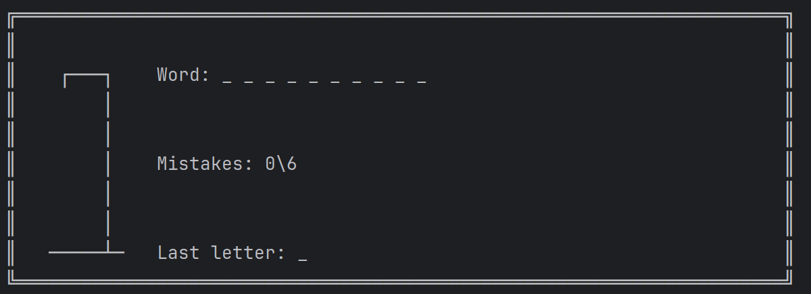

# Gallows

This application simulate game in gallows.



#### Rules:
- You have the choice to start the game or close the application;
    - You answer must be next string: "Yes"/"No";
- You get a word that has count of letters between 6 and 24;
- You must write a one russian letter;
- Game will ended if:
    - Your count of mistakes is equal 6;
    - You open all letters of the word;
- After end of game session, you must choose to start a next game or close application

#### Instruction to compile
```bash
javac -d classes src/*
java -cp classes/:resources/ Main
```
